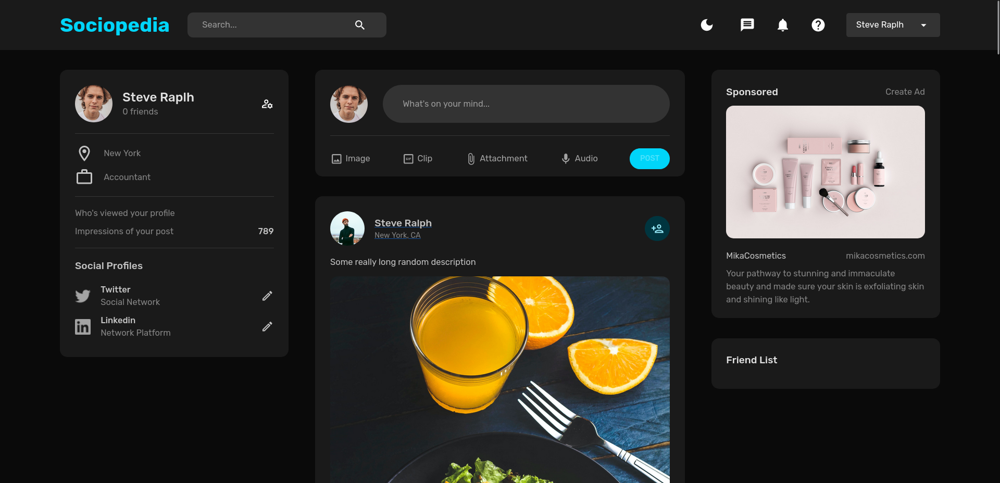

# Sociopedia

Sociopedia is an open-source social media platform that allows users to connect, share, and collaborate with others. It provides set of features for users to interact with each other, including creating posts, liking, commenting and following other users.



## Features

- User registration and authentication
- User profiles with profile pictures and bio
- News feed displaying posts from users
- Creating, liking, and viewing posts
- Following and unfollowing users
- Responsive design for mobile and desktop devices

## Technologies Used

- **React.js** for the frontend user interface
- **Node.js** and Express.js for the backend server
- **MongoDB** for the database
- **Redux** for state management
- **React Router** for routing
- **bcrypt.js** for password hashing
- **JSON Web Tokens (JWT)** for user authentication
- **Multer** for handling file uploads

## Getting Started

To run Sociopedia locally on your machine, follow these steps:

1. Clone the repository:

   ```shell
   git clone https://github.com/aslezar/Sociopedia.git
   ```

2. Navigate to the project directory:

   ```shell
   cd Sociopedia/server
   ```

3. Install the dependencies for the backend:

   ```shell
   npm install
   ```

4. Install the dependencies for the frontend:

   ```shell
   cd ../client
   npm install
   ```

5. Make a `.env` and update the configuration values with your own:

   - Set the `MONGO_URI` to your MongoDB connection string
   - Set the `JWT_SECRET` to a secret key for JWT authentication

6. Start the backend server:

   ```shell
   npm run server
   ```

7. Start the frontend development server:

   ```shell
   npm run client
   ```

8. Access Sociopedia in your web browser at `http://localhost:3000`.

## Contributing

Contributions to Sociopedia are welcome! If you find any issues or have ideas for new features, please submit them through the [GitHub issue tracker](https://github.com/aslezar/Sociopedia/issues).

If you would like to contribute code, please follow these steps:

1. Fork the repository.
2. Create a new branch for your feature or bug fix.
3. Make your changes and commit them with descriptive commit messages.
4. Push your changes to your forked repository.
5. Submit a pull request to the main repository.

Please ensure that your code follows the project's coding conventions and includes appropriate tests.
